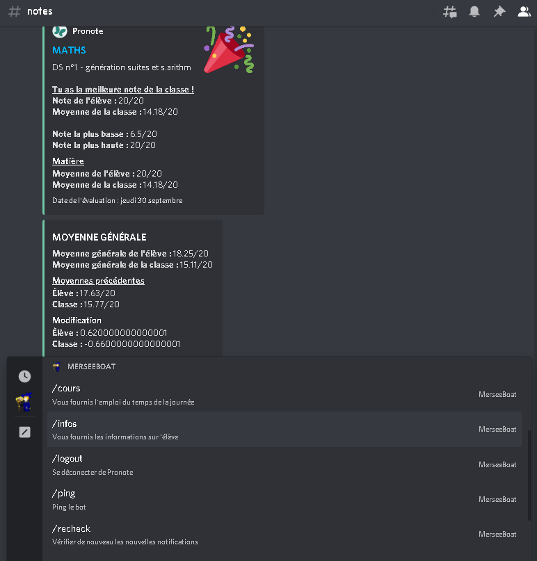

# Pronote Discord Bot

Un bot Discord très simple qui envoie des notifications  dans un salon sur Discord lorsqu'un devoir ou une note est ajouté sur Pronote, ou lorsqu'un enseignant est absent ! 📚  

Si vous êtes plus à l'aise avec Python vous pouvez également utiliser le bot de **[busybox11](https://github.com/busybox11/probote)**, qui sera surement compatible avec la dernière version de Pronote bientôt ! 💫

## Fonctionnalités

Ce bot *incroyable* peut vous permettre de réaliser plusieurs actions et d'avoirs des informations sur:

### Notifications
- Vos nouvelles notes
    * Indique le niveau de la note
        + La meilleure note de la classe
        + Une note au dessus de la moyenne de la classe
    * Indique **votre note**
    * Indique la **moyenne** de la casse
    * Indique la note la **plus basse**
    * Et indique la note la **plus haute**
    * Indique votre **moyenne** dans la **matière**
    * Indique la **moyenne** de la **classe*
- Puis pas extension, la moyenne générale
    * Moyenne générale de l'**élève**
    * Moyenne générale de la **classe**
    * L'**ancienne** moyenne de l'**élève**
    * L'**ancienne** moyenne de la **classe*
    * La *modification* qu'il y a eu pour l'**élève**
    * La *modification* qu'il y a eu pour la **classe**
- Pour les devoirs
    * La matière
    * Le devoir
    * La date pour le rendre
- Modification de cours
    * Si le cours est annulé ou que le professeur est absent
    * La matière
    * Le professeur
    * La date
- Nouvelles communications
    * L'auteur de la communication
    * Le titre de la communication
    * Le contenu de la communication

### Commandes
- `/cours` pour avoir l'emploie du temps du jour
- `/recheck` pour effectuer de nouveau une vérification
- `/ping` pour avoir le ping du bot et quelques informations
- `/info` pour avoir les informations sur le compte
- `/history` vous donne la liste des modification d'une moyenne (classe/élève pour une matière ou non)
- `/graph` vous donne un graphique des modification d'une moyenne (classe/élève pour une matière ou non)

## Installation

### Node.js
Node.js est requis pour le bon fonctionnement du bot. Il faut donc aller le [télécharger](https://nodejs.org/en/download/current/) sur son site à la **dernière** version, c'est à dire la `16.x.X`

### Windows
* Cloner le repository (`git clone https://github.com/Merlode11/pronote-discord-bot`) ou alors téléchargez la version compressée depuis GitHub
* Renommer le fichier `.env.example` en `.env` et le compléter.
* Lancer le bot avec le ficher bat `start-pronote-bot.bat`
* C'est fini !

### Mac/Linux *Ou aussi Windows, ça fonctionne aussi très bien*
*Il y a juste une étape en plus, ne vous inquiétez pas*

* Cloner le repository (`git clone https://github.com/Merlode11/pronote-discord-bot`) ou alors téléchargez la version compressée depuis GitHub
* Renommer le fichier `.env.example` en `.env` et le compléter.
* Installer les modules (`npm install`) *Via un terminal pointant vers le dossier du bot (`cd EMPLACEMENT_DOSSIER`)*
* Lancer le bot (`node index.js`)
* C'est fini !

### Remplir son `.env`
##### `PRONOTE_URL`
Indiquez ici votre URL sur lequel vous accédez à pronote, sans le `.eleve.html` et sa suite. Il faudra s'arrêter à `/pronote/`
##### `PRONOTE_CAS`
**Uniquement dans le cas où vous ne pouvez PAS vous connecter directement par Pronote, mais devez passer par une interface régionale spéciale**

**Si vous pouvez vous connecter directement sur l'interface de Pronote, l'API devrait fonctionner PEU IMPORTE VOTRE ACADÉMIE**

Sinon, l'API propose de se connecter à Pronote avec des comptes des académies suivantes :

  
CAS list

  
    - Académie d'Orleans-Tours (CAS : ac-orleans-tours, URL : "ent.netocentre.fr")
    - Académie de Besançon (CAS : ac-besancon, URL : "cas.eclat-bfc.fr")
    - Académie de Bordeaux (CAS : ac-bordeaux, URL : "mon.lyceeconnecte.fr")
    - Académie de Bordeaux 2 (CAS : ac-bordeaux2, URL : "ent2d.ac-bordeaux.fr")
    - Académie de Caen (CAS : ac-caen, URL : "fip.itslearning.com")
    - Académie de Clermont-Ferrand (CAS : ac-clermont, URL : "cas.ent.auvergnerhonealpes.fr")
    - Académie de Dijon (CAS : ac-dijon, URL : "cas.eclat-bfc.fr")
    - Académie de Grenoble (CAS : ac-grenoble, URL : "cas.ent.auvergnerhonealpes.fr")
    - Académie de la Loire (CAS : cybercolleges42, URL : "cas.cybercolleges42.fr")
    - Académie de Lille (CAS : ac-lille, URL : "cas.savoirsnumeriques62.fr")
    - Académie de Lille (CAS : ac-lille2, URL : "teleservices.ac-lille.fr")
    - Académie de Limoges (CAS : ac-limoges, URL : "mon.lyceeconnecte.fr")
    - Académie de Lyon (CAS : ac-lyon, URL : "cas.ent.auvergnerhonealpes.fr)
    - Académie de Marseille (CAS : atrium-sud, URL : "atrium-sud.fr")
    - Académie de Montpellier (CAS : ac-montpellier, URL : "cas.mon-ent-occitanie.fr")
    - Académie de Nancy-Metz (CAS : ac-nancy-metz, URL : "cas.monbureaunumerique.fr")
    - Académie de Nantes (CAS : ac-nantes, URL : "cas3.e-lyco.fr")
    - Académie de Poitiers (CAS : ac-poitiers, URL : "mon.lyceeconnecte.fr")
    - Académie de Reims (CAS : ac-reims, URL : "cas.monbureaunumerique.fr")
    - Académie de Rouen (Arsene76) (CAS : arsene76, URL : "cas.arsene76.fr")
    - Académie de Rouen (CAS : ac-rouen, URL : "nero.l-educdenormandie.fr")
    - Académie de Strasbourg (CAS : ac-strasbourg, URL : "cas.monbureaunumerique.fr")
    - Académie de Toulouse (CAS : ac-toulouse, URL : "cas.mon-ent-occitanie.fr")
    - Académie du Val-d'Oise (CAS : ac-valdoise, URL : "cas.moncollege.valdoise.fr")
    - ENT "Agora 06" (Nice) (CAS : agora06, URL : "cas.agora06.fr")
    - ENT "Haute-Garonne" (CAS : haute-garonne, URL : "cas.ecollege.haute-garonne.fr")
    - ENT "Hauts-de-France" (CAS : hdf, URL : "enthdf.fr")
    - ENT "La Classe" (Lyon) (CAS : laclasse, URL : "www.laclasse.com")
    - ENT "Lycee Connecte" (Nouvelle-Aquitaine) (CAS : lyceeconnecte, URL : "mon.lyceeconnecte.fr")
    - ENT "Seine-et-Marne" (CAS : seine-et-marne, URL : "ent77.seine-et-marne.fr")
    - ENT "Somme" (CAS : somme, URL : "college.entsomme.fr")
    - ENT "Portail Famille" (Orleans Tours) (CAS : portail-famille, URL : "seshat.ac-orleans-tours.fr:8443")
    - ENT "Toutatice" (Rennes) (CAS : toutatice, URL : "www.toutatice.fr")
    - ENT "Île de France" (CAS : iledefrance, URL : "ent.iledefrance.fr")
    - ENT "Mon collège Essonne" (CAS : moncollege-essonne, URL : "www.moncollege-ent.essonne.fr")
    - ENT "Paris Classe Numerique" (CAS : parisclassenumerique, URL : "ent.parisclassenumerique.fr")
    - ENT "Lycee Jean Renoir Munich" (CAS : ljr-munich, URL : "cas.kosmoseducation.com")
    - ENT "L'Eure en Normandie" (CAS : eure-normandie, URL : "cas.ent27.fr")  
    - ENT "Mon Bureau Numérique" via EduConnect (CAS: monbureaunumerique-educonnect, URL: "cas.monbureaunumerique.fr")

##### `PRONOTE_USERNAME` et `PRONOTE_PASSWORD`
Indiquez ici votre identifiant (`USERNAME`) et votre mot de passe (`PASSWORD`) pour que le bot puisse se connecter à pronote via votre compte

⚠ Vous identifiants doivent restés **PRIVÉES** et personne ne doit y avoir accès. Faite attention à ne donner aucun de vos identifiants, ne pas donner directement le code. Vous pourriez par oubli donner vos identifants. Faites bien attention de donner le code uniquement via ce repository

##### `TOKEN`
Indiquez ici le token de votre bot pour qu'il puisse se connecter à Discord. Allez dans le [portail développeur](https://discord.com/developers/applications/) et récupérez ici le token de votre bot

##### `CHANNEL`
Complétez toutes les variables finnissant par `CHANNEL` par les identifiants des salons où seront envoyés les notifications:
* `HOMEWORKS_CHANNEL_ID` Le salon pour les nouveaux devoirs à la maison
* `MARKS_CHANNEL_ID` Le salon pour les nouvelles notes
* `AWAY_CHANNEL_ID` Le salon où seront envoyés les cours annulés
* `INFOS_CHANNEL_ID` Le salon pour les nouvelles informations (Communication & sondages)

## Crédit

Le bot est à l'origine créé par [@Androz2091](https://github.com/Androz2091/pronote-bot-discord). Je lui ai apporté des modifications pour l'améliorer et le rendre plus utile que ce qu'il n'était. 

## Retours
### Bugs
En cas de bug ou de problème d'installation vous pouvez ouvrir une [**`Issue`**](https://github.com/Merlode11/pronote-bot-discord/issues/new?assignees=Merlode11&labels=bug%2C+help+wanted&template=signaler-un-bug.md&title=%5BBUG%5D) ou alors contactez moi sur Discord: `Merlode#8128`
### Suggestions
Si vous avez la moindre suggestion, proposez là dans les [**`Issue`**](https://github.com/Merlode11/pronote-bot-discord/issues/new?assignees=Merlode11&labels=enhancement&template=proposer-une-fonctionnalit-.md&title=%5BSUGGESTION%5D), elles sont là pour ça
### Merci
Merci à vous de me supporter dans cette aventure que je commence tout juste et si vous pouvez laisser une petite star ça ferait vraiment plaisir
